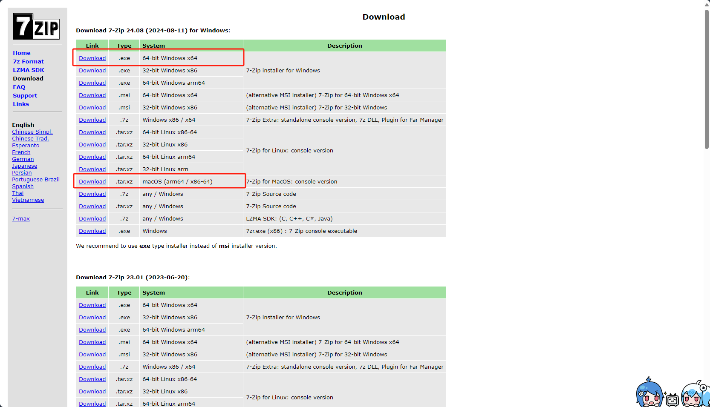
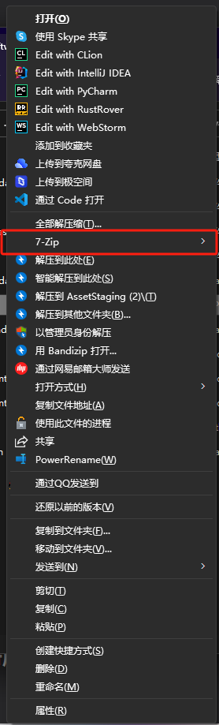
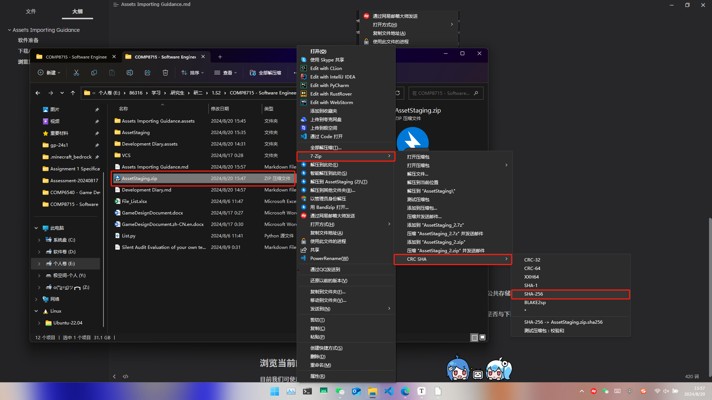
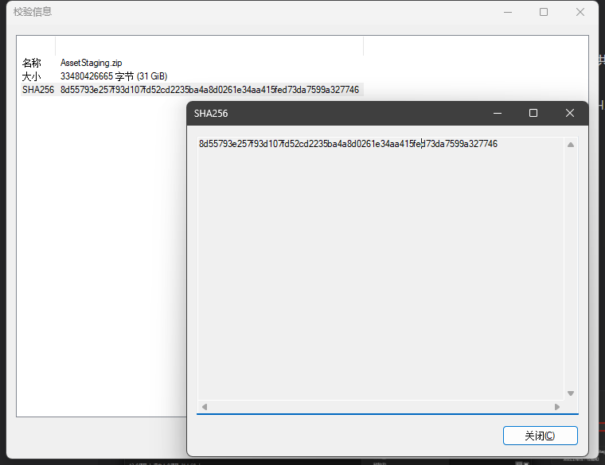

# Assets Importing Guidance - draft

目前阶段（Week 5 ~ Week 6）我们的主要工作是将你工作范围内觉得有用的Asset进行标注，以方便Week 6之后的Asset Importing。本流程会指导你如何进行Asset 标注以及标注的规范，并在后续阶段（Week 6之后）指导你如何进行import。

## 软件准备

为了方便软件的校验工作，我们推荐你只用7-zip自带的SHA-256校验功能进行后续步骤。

下载内容可通过 [Download (7-zip.org)](https://7-zip.org/download.html) 访问，选择你系统的对应版本：

现在当安装完7-zip后你会发现右键菜单栏（Windows 11 请使用Shift + 右键）多出了一个7-zip的选项 （很遗憾由于电脑系统语言环境我没法给出更清晰的截图）

到这一步说明你安装成功了。

## 下载Asset Packages

虽然在第一周时我们的客户已经提供了对应的下载链接，但是很遗憾它已经失效了，如果你在那七天内没有下载可以通过下面的链接重新下载：

[!] 注意：请勿将该下载链接与下载完成的内容分享给与当前项目无关的任何人或保存到公共存储介质中，如因此造成的各种损失、纠纷问题请自行承担。

当你下载成功以后，请点击当前压缩包“AssetStaging.zip”，选择“7-zip -> CRC SHA -> SHA-256” 进行文件校验（见下图），使用7-zip 确认其校验码是否与下面的校验码对应，预估要2到10分钟左右：

>   8d55793e257f93d107fd52cd2235ba4a8d0261e34aa415fed73da7599a327746

如果该编码与你的内容一致表示你下载成功了。

## 浏览当前的Asset库

目前我们可使用的Asset有