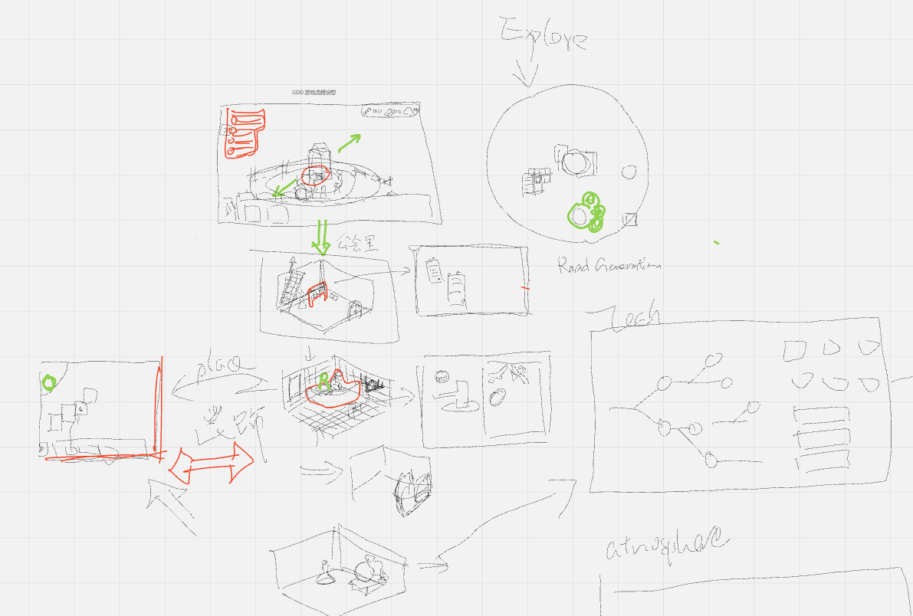
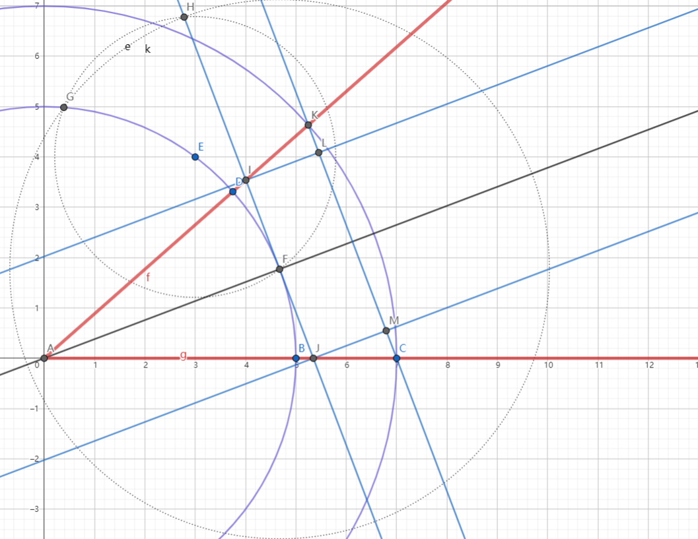
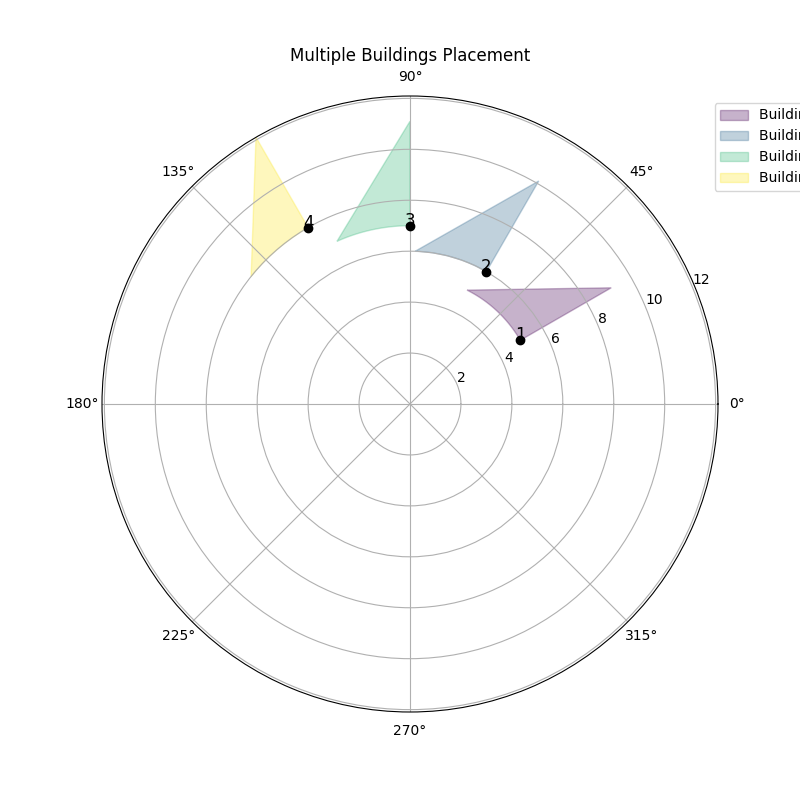

**Project Development Diary**

## **Project Name: The Guild - Unreal Engine 5 - Game Development**

### **Project Background**

This project aims to develop a game using Unreal Engine, documenting the weekly development progress, challenges faced, and solutions from initial environment setup to final game release.

### **Week 1 Log**

#### **Time Frame**

July 27, 2024 - August 4, 2024

#### **Work Summary**

1.  **Unreal Engine Environment Setup**
    -   Downloaded and installed the latest version of Unreal Engine 5.4.3.
    -   Configured the basic development environment.
    -   Tested the engine to ensure it runs correctly by creating a simple test project.
2.  **Git Environment Configuration**
    -   Installed and configured Git.
    -   Created a remote repository on GitHub for the project.
    -   Connected the local repository to the remote repository and performed the initial code commit.
    -   Set up a basic .gitignore file to exclude unnecessary files and directories.
3.  **Create development management tools**
    -   Creating necessary tools for team development management such as Trello, GitHub organization, and Google shared folder.

#### **Detailed Steps**

1.  **Unreal Engine Environment Setup**
    -   Visited the Unreal Engine official website and downloaded the latest version of the installer.
    -   Ran the installer and followed the prompts to complete the installation.
    -   Opened Unreal Engine, logged into the Epic Games account, and ensured the engine runs correctly.
    -   Created a new project in the engine, selecting an appropriate template (e.g., First Person Shooter or Third Person Template).
    -   Ran the project to ensure there were no errors.
2.  **Git Environment Configuration**
    -   Downloaded and installed the Git tool (from the Git official website).
    -   Opened the command line or Git Bash and ran the following commands for basic configuration:
         git config --global user.name "Your Name"
         git config --global user.email "your.email@example.com"
    -   Created a new repository on GitHub and obtained the repository URL.
    -   Initialized a Git repository in the local project directory and connected it to the remote repository:
         cd your_project_directory
         git init
         git remote add origin your_repository_url
    -   Created and configured a .gitignore file, adding common Unreal Engine exclusions such as:
         *.log
         *.tmp
         Binaries/
         Build/
         DerivedDataCache/
         Intermediate/
         Saved/
    -   Added project files to the repository and committed:
         git add .
         git commit -m "Initial commit"
         git push origin master
3.  …

#### **Issues Encountered and Solutions**

-   **Slow Engine Installation**
    -   Improved download speed by changing the network or using download accelerators (e.g., VPN).
-   **Severe Lag In UE5**
    -   A team member is experiencing severe lag issues while running Unreal Engine. 
    -   It is currently understood that the team member's graphics card is a GTX 1050, which should not cause severe rendering lag. We are awaiting offline diagnostics.
-   **Git Connection Issues**
    -   Ensured local Git configuration is correct and checked for the correct remote repository URL.
    -   Used SSH instead of HTTPS to connect to GitHub for increased security and convenience.

#### **Next Steps**

-   Continue with the UE5 learning course.
-   Create gitlab CECC repo
-   Assets management

------

### **Week 2 Log**

#### **Time Frame**

August 5, 2024 - August 11, 2024

#### **Work Summary**

#### **Detailed Steps**

#### **Issues Encountered and Solutions**

#### **Next Steps**

------

### **Week 3 Log**

#### **Time Frame**

July 29, 2024 - August 4, 2024

#### **Work Summary**

#### **Detailed Steps**

#### **Issues Encountered and Solutions**

#### **Next Steps**

------

### **Week 4 Log**

#### **Time Frame**

August 12, 2024 - August 18, 2024

#### **Work Summary**

完善GDD的大致框架，讨论资产导入的具体方案。

Refine the broad framework of GDD and discuss specific options for asset importation.

#### **Detailed Steps**

GDD框架具体内容详见[The Guild - Group 1 Team - Game Design Document v1.2.docx - Google Doc](https://docs.google.com/document/d/1K_0el1X_AVJZNwoVVcJOaMZIKZR570A3/edit) v1.1

资产导入具体方案依照[20240818_TeamMeeting - Google Doc](https://docs.google.com/document/d/1uqI5hcOV-ITnQwch1I8sbjOBA0Z1TYTHWzqs9pL6PF4/edit#heading=h.d5264hze6auw) 将资产分为不同细类并依据预先评估的工作量进行分工，团队不同成员负责不同工作。

GDD framework specifics are detailed in [The Guild - Group 1 Team - Game Design Document v1.2.docx - Google Doc](https://docs.google.com/document/d/1K_0el1X_ AVJZNwoVVVcJOaMZIKZR570A3/edit) v1.1

Asset import specific programs in accordance with [20240818_TeamMeeting - Google Doc](https://docs.google.com/document/d/1uqI5hcOV-ITnQwch1I8sbjOBA0Z1TYTHWzqs9pL6PF4/edit#) heading=h.d5264hze6auw) divides the assets into different sub-categories and divides the workload based on a pre-assessed workload, with different team members responsible for different tasks.

Translated with DeepL.com (free version)

#### **Issues Encountered and Solutions**

None

#### **Next Steps**

1.  对GDD框架进行详细补充
2.  撰写资产导入指导性文档

1. Detailed additions to the GDD framework
2. Write guidance documents for asset importation
3.  

------

### **Week 5 Log**

#### **Time Frame**

August 19, 2024 - August 25, 2024

#### **Work Summary**

详细讨论了关于GDD文档的细节内容，并对建设系统的整体流程进行大致的规划。

#### **Detailed Steps**

按照之前提出的GDD文档框架的内容进行可行性分析，确定了一下内容：

1.   基地的边界确定为虚拟的划分，并不存在实际的物理边界例如河流、悬崖
2.   确定Grid System在基地外部部分是放射状的环绕部署，内部是标准的十字方格
3.   确定部分生产系建筑的实际产出：农场、牧场都会提供食物，但是会额外提供不同的副产物
4.   新增对于信仰属性的支持建筑
5.   （暂时忽略对于基地建设的具体流程规划）
6.   删除自定义区域的仓库管理系统
7.   去除时间系统中的天气系统
8.   将氛围影响因素中的对于NPC的影响去除，归类到NPC系统（可选）中
9.   （供给系统暂时等待探索组的决定）

通过流程假想，确定下列需求：

1.   内部场景的视角切换确定为3/4视角和俯视视角的来回切换
2.   科技树目前可以通过基地等级（Tier n）进行限制（可选）
3.   添加游戏的目的性引导

Based on the feasibility analysis using the previously proposed GDD document framework, we’ve identified the following details:

1. **Base Boundaries**: The boundaries of the base are defined as virtual divisions, without any physical obstacles like rivers or cliffs.
2. **Grid System**: The grid system outside the base will be arranged in a radial pattern, while the internal grid will follow a standard cross-grid layout.
3. **Production Buildings Output**: Certain production buildings, such as farms and ranches, will provide food as well as additional by-products.
4. **Support for Faith Attributes**: Buildings that support faith attributes have been added.
5. **Base Construction Process**: The specific planning process for base construction is temporarily set aside.
6. **Warehouse Management**: The custom area warehouse management system has been removed.
7. **Weather System**: The weather system within the time system has been removed.
8. **Atmosphere Influence Factors**: The impact of atmosphere on NPCs has been removed and categorized under the NPC system (optional).
9. **Supply System**: The supply system is temporarily awaiting the exploration team's decision.

**Requirements Based on Process Assumptions**:

1. **Internal Scene View Switching**: The internal scene view will toggle between a 3/4 view and a top-down view.
2. **Technology Tree**: The tech tree can be optionally restricted by base level (Tier n).
3. **Game Objective Guidance**: An objective-based guidance system will be added to the game.

#### **Issues Encountered and Solutions**

None

#### **Next Steps**

具体的决定等待客户的详细回复

Other Detail:

-   Music & Sound Effect
-   UI design
-   Tech Tree

------

### **Week 6 Log**

#### **Time Frame**

August 5, 2024 - August 11, 2024

#### **Work Summary**

1.  详细讨论了辐射状网格放置的实现方法
2.  确定项目的构建与初始化流程
3.  构建对话系统的基本模板

#### **Detailed Steps**

**辐射状网格放置**

在仔细讨论辐射状网格实现方法时，我们目前遇到的主要问题是：无法通过常规的网格表储存变量；UE中没有预设的类似Grid的预设数据体结构供该形状使用；假设通过单位角弧度划分建筑网格会出现越靠近圆心建筑体积越小的情况。因此，我们目前规划直接通过数学计算的方式实现弧状建筑的放置。当玩家拖动建筑物到某一个坐标时，我们可以获得三个参数：建筑物的长宽x,y,以及建筑物与圆心构成的圆的切线点到圆心的半径r（下文简称内径），由此我们可以得到在当前内径下同种建筑物拖动到相同半径时其弧形空间所占的夹角θ
$$
θ = 2 artan(\frac{x}{2r})
$$
还能得到对应的外径R
$$
R = (r+y) cos \frac{θ}{2}
$$
此外，为了方便对其，我们可以将计算得到的θ与R向上取整，并将当前的建筑物通过进一步计算进行居中。

当然后续就会出现一个问题，如何确定得到的参数的向上取整的具体单位长度，因为极坐标的问题，弧长与内外径差之间必定存在一定误差使其无法近似于正方形以用于网格系统，因此该数值设定还待调整。

另外，考虑到这种数学计算会对设备的性能有一定要求，我们考虑为其添加动态规划算法：对应参数的内容会先参考结果表，如果表中未记录相关参数那么系统在进行上述计算，然后将结果添加到表中，以提高运行效率。

**项目初始化流程**

目前经过多次测试我们已经将项目初始化过程中遇到的几个常见问题添加到Issue Log中以供其他组员参考。基本上，开发人员只需要通过git clone相关项目文档，再通过UE直接打开即可，后续编译时会用到Rider作为主要开发IDE。当然如果打开项目时遇到编译失败等信息，我建议优先检测UE文档以及项目文档的权限所属问题，确认你当前文件夹有完全控制权限。详细内容以备注在Log中。

**对话系统**

实现对话系统时我们考虑到下述场景：当玩家当前处于任务A中时，他打开NPC A的对话框应该会出现常规对话选项以及当前任务事件的对话选项，因此我们考虑通过动态接口的方式调整当前NPC的对话窗口内容。我们使用EventTable （自定义类，详见`EventDescription.h`）储存事件对话信息，后续会通过EventSystem动态为NPC赋予对应的事件ID。

而当在任务A中打开NPC A的任务对话选项，程序首先会通过NPC身上的`EventDescription`接口找到当前事件ID，然后会通过ID在EventTable中查找对应事件的文字文本文件以及图片文件的路径索引，再通过索引将内容添加到UI上。上述目的是为方式RAM过多加载非必要的物体数据，并只在用到的时候进行调用，同时也方便后续开发的快速编辑。

#### **Issues Encountered and Solutions**

等待辐射状网格放置系统的具体参数设定。

部分组员在项目初始化时会出现编译错误的情况，目前暂时确定是文件权限以及编译器的适配问题，进一步原因还在验证。

对话系统中的对话框关闭按钮需要点击多次或点击后等待两三秒才能实现快速关闭，目前正在排查蓝图脚本的生命周期问题。

#### **Next Steps**

确定实际开发时的职能分配，规划系统的整体框架与实现方法，确定各种抽象类与枚举类等公用内容。

------