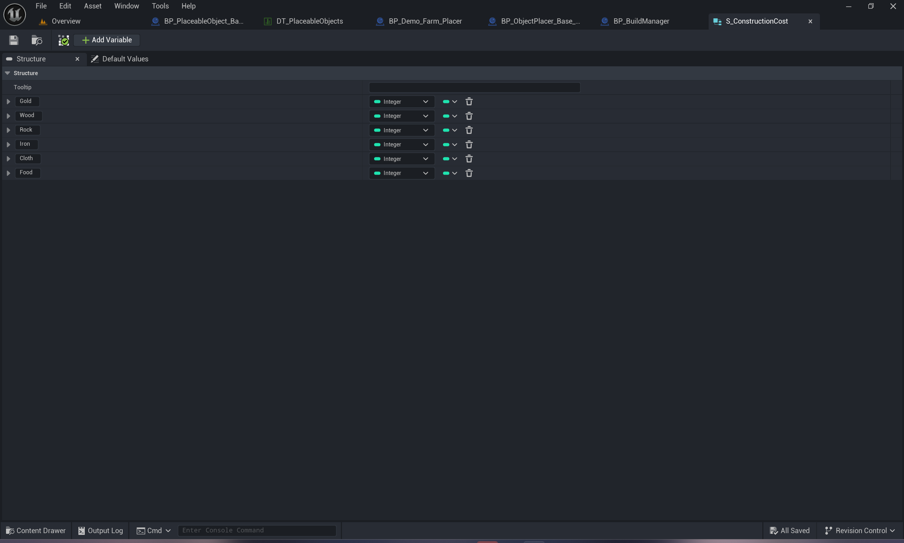
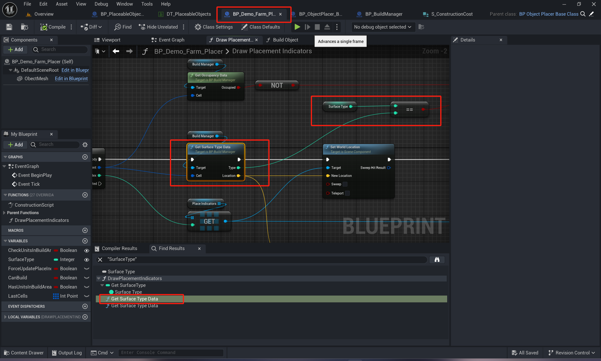
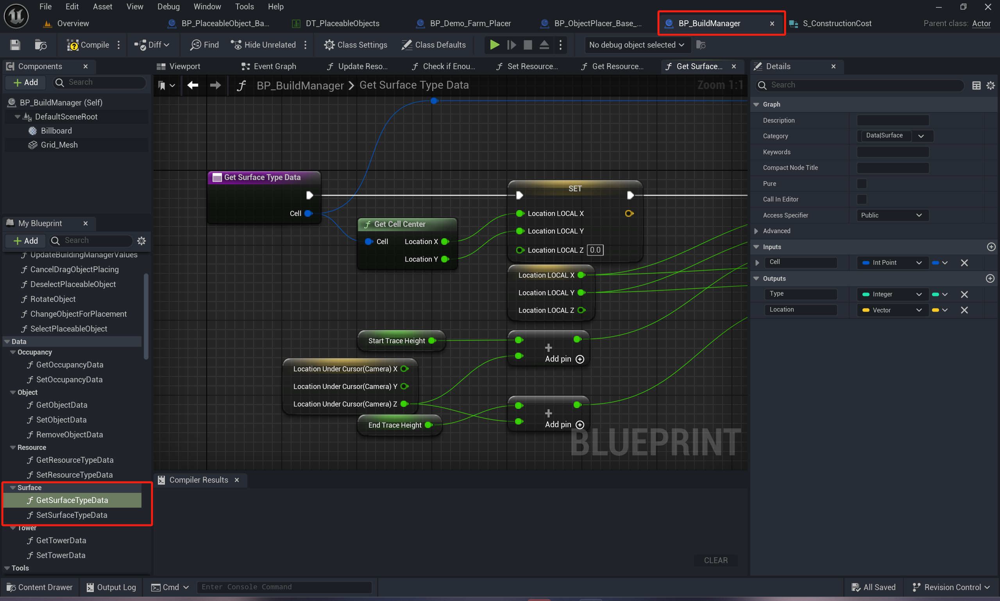
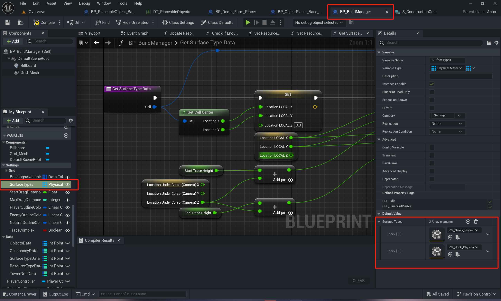
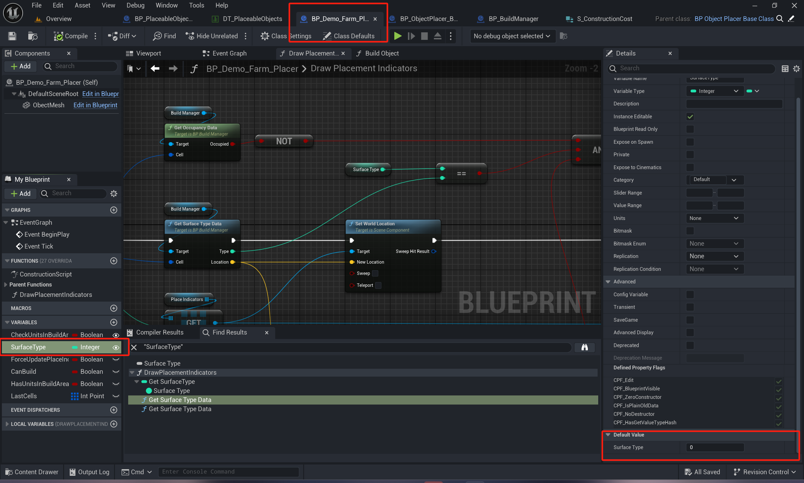

# Grid Building System 解析

### 半成品资源系统

BP_BuildManager中存在Data/Resource 函数调用方法

其使用`S_ConstructionCost`作为数据储存，在Conten/Data中

可在此自定义资源类。

并修改Get/Set Resource函数

### 放置特殊材质检测（Farm示例

不同建筑有各自的Placer，在Farm Placer中存在Surface Type Data检测：

Get Surface Type Data 存在于BP_BuildManager中

其主要参照其内部参数SurfaceTypes，依照Types表的下标比对当前地面是否可放置

可以看到Farm Placer中存在Surface Types = 0，当其与GetSufaceTypeData得到的内容一致时表示可放置：

